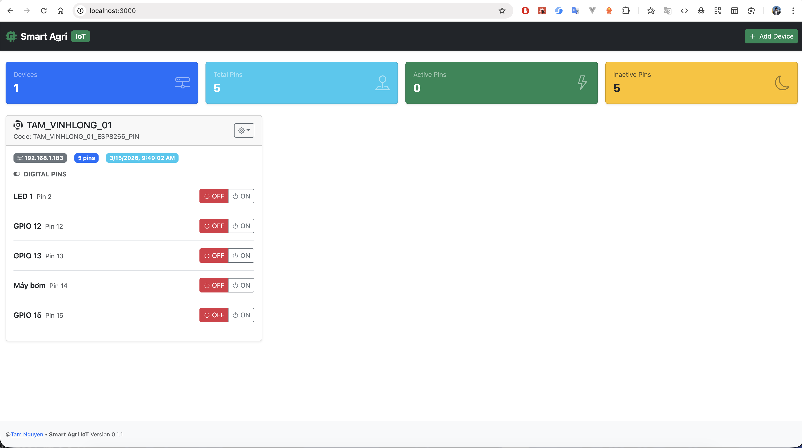

# Smart Agri Web App
Ứng dụngr  điều khiển ESP8266 thông qua giao diện web

## Register for a HiveMQ account (free)
https://console.hivemq.cloud/

## Run Smart Agri Web App



**Run with docker**
```bash
./start_dev_docker.sh
```

hoặc

```bash
docker-compose -f docker-compose.dev.yml up
```

## Seed data

**Test Code**
```
Name: TAM_VINHLONG_01
Code: TAM_VINHLONG_01_ESP8266_PIN
```

Command to run seed data
```bash
rails db:seed
```

## Arduino Code
Xem thêm tại thư mục `arduino/README.md`

## MQTT Client
- MQTTX (https://mqttx.app/ - https://github.com/emqx/MQTTX)
- MQTT Explorer (https://mqtt-explorer.com/ - https://github.com/thomasnordquist/MQTT-Explorer)
- MQTT Toolbox (https://www.hivemq.com/mqtt-toolbox/)
